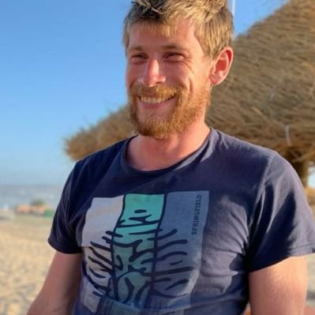
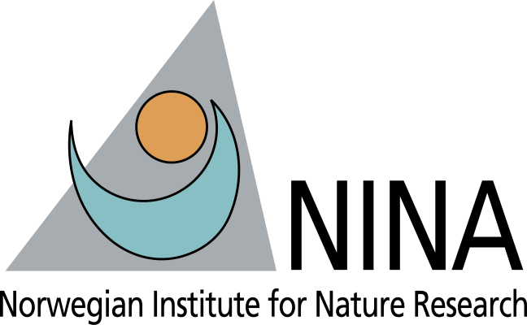
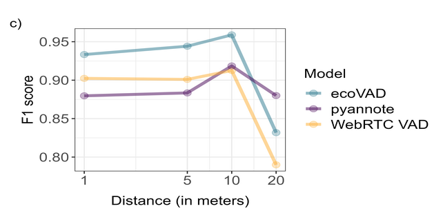
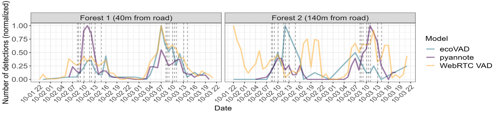

<!-- _class: lead invert -->

# ecoVAD :four_leaf_clover:

### An end to end pipeline for training and using Voice Activity Detection models in soundscape analysis.

Benjamin Cretois

---

 benjamincretois

  ssssss

---

<!-- _class: lead invert -->

# Background

---

# Background

:sound: Eco-acoustic monitoring is **increasingly being used** to map biodiversity across large scales

 

:confused: Little thought is given to the **privacy concerns** and potential **scientific value** of inadvertently recorded human speech

 

:collision: We developed an end-to-end VAD pipeline and show how VAD models can be used for both!

---

<!-- _class: lead invert -->

# Method

---

# Method

We compare our pipeline with 2 state-of-the-art VAD models:

- [Pyannote](https://github.com/pyannote/pyannote-audio)
- [Google's WebRTC VAD](https://github.com/wiseman/py-webrtcvad)

 

:star: **Note** that in our repo we provided wrappers for using both models

--- 

# Method

 

**Training** :deciduous_tree: : We collected soundscape data that we mixed with human voices & other noises.

**Testing** :man: :woman: :child: : playback experiments with speech samples from a man, woman, and child at 1,5,10 and 20 meters.

**Using**: we collected soundscape from a recreational area to evaluate the ability of the models to detect human speech.

---

<!-- _class: lead invert -->

# Results

---

# Results

- All model performed well on the playback data

 

- Our custom model performs better

---

# Results

---

<!-- _class: lead invert -->

# Discussion

---

# Discussion

:star: Specificity vs state-of-the-art

:star:

:star: Speech detections as a direct measure of anthropogenic noise pollution and indirect proxy of human disturbance 

---

# Discussion

:arrow_right: Have a look at the [ecoVAD GitHub repo!](https://github.com/NINAnor/ecoVAD)

:arrow_right: And very soon the paper!

